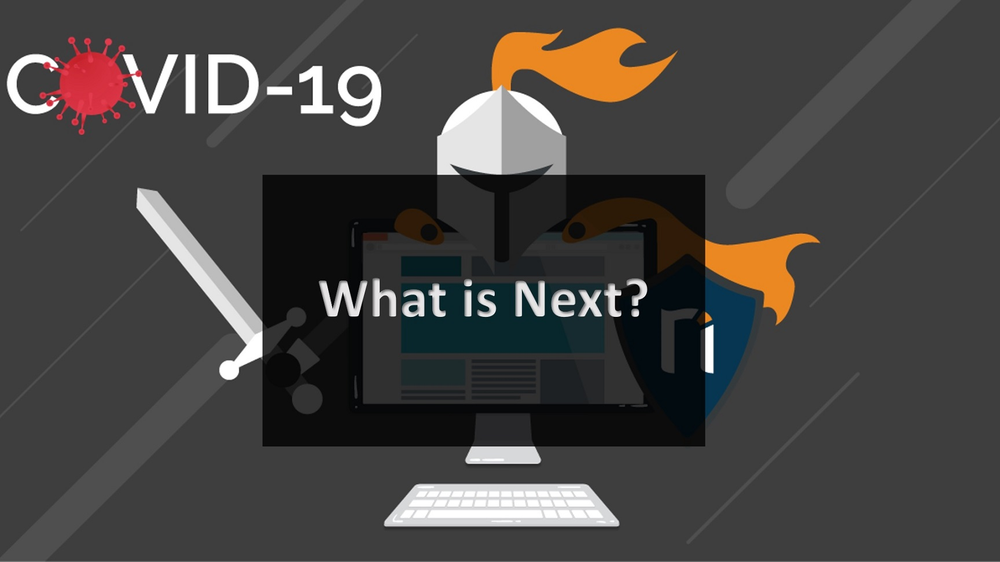
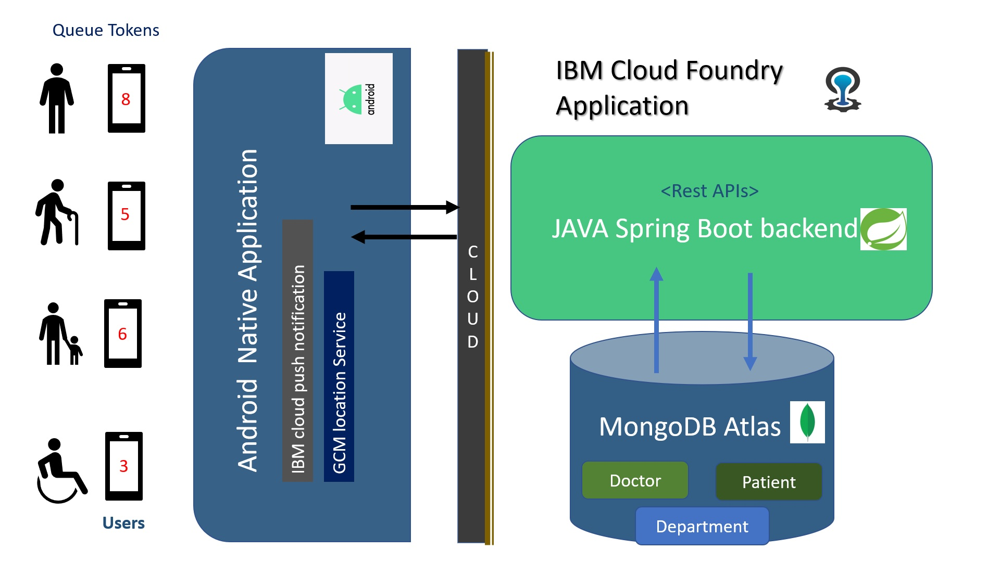
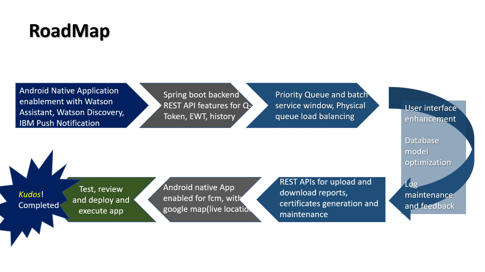

# WellnessQ

Automation tool that virtualizes the waiting Queue At medical centers, Labs and  hospital. Specifically during the hour of crisis like Covid-19 pandemic.


*Read this in other languages: [English](README.md), [한국어](README.ko.md), [português](README.pt_br.md).*

## Contents

1. [About Existing Medical Procedure](#About-Existing-Medical-Procedure)
1. [Demo video](#demo-video)
1. [The architecture](#the-architecture)
1. [Long description](#long-description)
1. [Project roadmap](#project-roadmap)
1. [Getting started](#getting-started)
1. [Running the tests](#running-the-WellnessQ-app)
1. [Live demo](#live-demo)
1. [Built with](#built-with)
1. [Authors](#authors)


## About Existing Medical Procedure

The existing PCR test is registered through a self reporting form for COVID-19 Sample collection.
After submission of the form the mobile number provided in the form gets the OTP , id, Sample ID as a text message. 
They also get provided a link to download ICMR Specimen Referral Form For Covid-19(SARS-CoV2).At Medical centers and collection centers they do not have the real-time tracking application for queue status while waiting at the quarantined place for their turn to appear.

### Problem Statement

The Medical centers and collection centers do not have the real-time tracking application for queue status while waiting at the quarantined place for their turn to appear.

### How can technology help?

We can automate the queue into virtual one so that the patient does not have to stay anxious for its turn for long. It can track the people those are there before and stay alert about its turn. we as well as send the certificate of people who tested negative. Apart from the Covid-19 patients, it can also help the other category of health  department. which will facilitate patients to stay safe while maintaining safe social distancing

### The Idea: Solution

 1. Multiple categories: one category will be covid-19 

 2. Inside that the user has to answer certain questions 

 3. Recommend the user with the list of test/Health facility centers nearer

 4. Option to select an appointment slot time

 5. In that slot, option to view number of people in Queue  
              
 6. Request for queue Token
 
 7. Option track users turn 

 8. Responsive notification alert 

 9. Downloading certificate for Tested negative reports 


## Demo video

[](https://youtubeLink)

## The architecture




1. Login 

    a. Generate OTP
    b. Login using OTP
    c. Select type 
         c1. Doctor
         c2. Patient
    d. Edit profile
    e. View Notification
    f. Logout


2. Search/Select for available 
     
     a. View All Health Category
     b. Search available doctors, health center and labs for a perticular slot and department
     c. View My requests for queue
     d. View number of appointments already taken for a particular time slot

3. Request and track
    
      a. Request for Queue
      b. Delete your request
      c. Get real-time notification when queues are updated 

4. The android app uses push notification service and FCM service - OTP base Authentication

5. The android app makes REST API calls to spring boot backend to get records of users

6. The Spring boot backend is connected to MongoDB in cloud

7. The Software product WellnessQ is deployed in IBM cloud foundry Application

8. Google Maps -Connected to Android Application

9. Retrofit used for making REST API call


## Project roadmap



## Getting started

The following instructions will get you a copy of the project up and running on your local machine for development and testing purposes. See deployment for notes on how to deploy the project on IBM Cloud foundry.

### Prerequisites

What things you need to install the software and how to install them

```bash
Spring Tool Suite 4
Android Studio
mongoDB
IBM cloud foundry Application
FCM Phone Authentication
IBM cloud push notification service
Google Map
```

### Installing


1. Spring-boot backend set up

```bash
Install java eclipse 
Import existing maven project
maven install
maven build and set goal to "spring-boot:run"
Application is now running on tomcat server
Server running at http://localhost:8080/
```

2. Android Native Set up

```bash
install Android studio
import project
```

  Download  in your android mobile phone and run the application.


## Running the tests
[Swagger UI](http://wellnessq.mybluemix.net/swagger-ui.html)

### manifest.yml file

yml file used for deployment

```bash
applications:
- instances: 1
  timeout: <ms>
  name: <name>
  buildpack: java_buildpack
  path: ./target/<jarfilename>.jar
  disk_quota: 1G
  memory: 512MB
  domain: mybluemix.net
  host: <hostname>
  env:
    JAVA_OPTS: '-XX:ReservedCodeCacheSize=32M -XX:MaxDirectMemorySize=32M'
    JBP_CONFIG_OPEN_JDK_JRE: '[memory_calculator: {stack_threads: 30}]'
```

### And Cloud foundry application deployment

[how to deploy your application to cloud fooundry](https://docs.cloudfoundry.org/cf-cli/install-go-cli.html)
Keep your deployable jar and manifest.yml file in the same folder and open cammand prompt from that file location. Run following two commands to deploy your application.

```bash
cf login --sso
cf push
```

## Live demo

You can find a running system to test at [wellnessq.mybluemix.net](http://wellnessq.mybluemix.net/)

## Built with

* [IBM Cloudfoundry](https://cloud.ibm.com/catalog?search=cloudant#search_results) - Application deployed in IBM Cloud foundry Application
* [IBM Push Notifications](https://cloud.ibm.com/catalog/services/push-notifications) - Ability to personalize and send notifications
* [MongoDB Atlas](https://www.mongodb.com/world?tck=cloud_login) - The NoSQL database used
* [Java STS](https://spring.io/tools) - The IDE used for backed development
* [Maven](https://maven.apache.org/) - Dependency management
* [Android Studio](https://developer.android.com/studio) - The IDE used for andriod development
* [Swagger ui](https://swagger.io/) - Enabled -To view REST APIs
* [Firebase phone authentication](https://firebase.google.com/docs/auth/android/phone-auth) - OTP based phone Authentication
* [Google Map](https://developers.google.com/maps/documentation/android-sdk/start) - allows us to integrate google maps in Android Application

## Authors

* **Ananya Stitipragyan** - *Java Spring-boot Backend, MongoDB and Document work*
* **Supriya Sinha** - *Android, Spring-boot, front-end development, integration, push notification, phone authentication, and google Map integration , Map deployment, MongoDB* 

